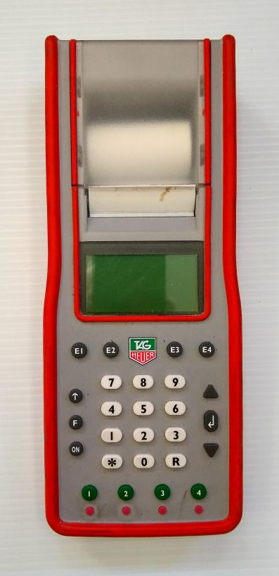

TAG-Heuer CP 540/545
====================
*Relevant ICR section:* :term:`611.2.1`
*Full manual:* `<https://reliableracing.com/downloads/cp540.pdf>`_

The TAG CP 540/545 is the main timer used for homologated races at Mammoth Mountain. It operates in Time of Day mode and prints impulses continuously to tape as per FIS rules. It can time to a maximum precision of 1/100,000th of a second, although only 1/10,000th is needed for scored races. This page will explain some common tasks and settings.

Basic setup
-----------
To turn on the CP 540, press and hold the on button for 5 seconds. If it doesn't turn on, see :ref:`CP 540 won't turn on`.

The 'F' button is used to access the menu, and the arrows and return key buttons on the right are used to navigate. The green buttons on the bottom represent timing inputs 1-4. The small red buttons below them are used to block or unblock the inputs.

Turning on the printer
~~~~~~~~~~~~~~~~~~~~~~
The printer should be on by defualt, although it can shut itself of if running on low battery power. The printer must be on at all times according to FIS rules (:term:`611.2.1`). To ensure that it is on, navigate to :menuselection:`F --> Printer --> On`.

Setting timing precision
~~~~~~~~~~~~~~~~~~~~~~~~
FIS rules require timing precision of at least 1/10,000th of a second (0.0001 s). To set this, navigate to :menuselection:`F --> Parameters --> Precision --> 1/10'000`.

Set lock time
~~~~~~~~~~~~~
The lock time is the interval following an impulse that the timer will not accept another impulse. This is useful to avoid multiple false impulses for the same racer. For example, if a racer breaks the finish beam with their pole first, then their boot 0.02 s later, the first impulse is their legal finish time and the second one is not needed. The second impulse will likely cause a false finish for the next racer. To avoid this, finish impulse lock times can be set at 0.10 s. Don't set this interval too high, because close finishes can happen. For adaptive races with visually impaired racers skiing with a guide this setting must be set as low as possible.. See :ref:`Adaptive and Paralympic Races`. Start impulse lock times can be set much higher, because there is no chance of two legal start happening within seconds of each other.

To set the lock times, navigate to :menuselection:`F --> Parameters --> Lock Time --> Input #` and enter the desired time. The minimum is 0.01 s. After setting, the lock time will be printed to the tape.

Here is an example of a timer with a :ref:`start gate <Start Block>` connected to input 1 with a lock time of 1.00 second, and :ref:`photocells <Photocell Pair>` for interval times and the finish connected to inputs 2-4 with lock times of 0.10 s.

