Equipment List
==============

.. Name
   -----------

  .. image:: ../img/equipment/foo.jpg
    :width: 30%
  
  :Model number(s): 
    numbers here
  :Homologation number(s):
    numbers here
  :Description: 
    Desc here
  :Troubleshooting: 
    TS here

Start Area
~~~~~~~~~~

Start Block
-----------

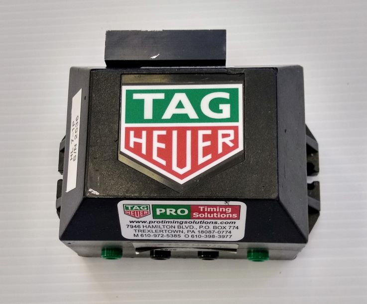
  
:Model number(s): 
  HL 7-1, HL 7-1P
:Homologation number(s):
  test
:Description: 
  Start block for homologated races. Two separate internal contacts connected to two banana plug outputs on the bottom.
:Troubleshooting: 
  Check all connections. Check for signs of lightning damage. A malfunctioning start block will typically need to be sent in for service.
  
Start Wand
-----------

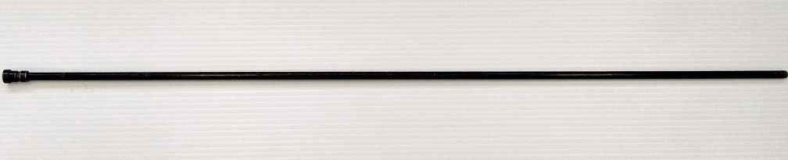
  
:Model number(s): 
  N/A
:Homologation number(s):
  N/A
:Description: 
  Start wand to fit into TAG Start Block
:Troubleshooting: 
  If it breaks throw it away
  
Start Block Chain
------------------

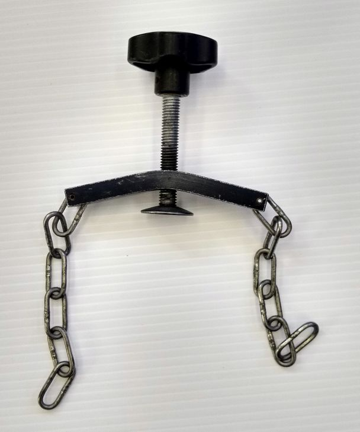
  
:Model number(s): 
  N/A
:Homologation number(s):
  N/A
:Description: 
  Backing chain to attach start block to start post.
:Troubleshooting: 
 
 
Headset with TAG Plug Adaptor Attached
--------------------------------------

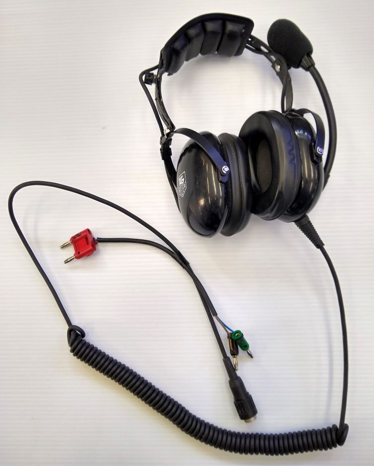
  
:Model number(s): 
  
:Homologation number(s):
  N/A
:Description: 
  Headset to fit into TAG HL 551 Com Box
:Troubleshooting: 
  Check wires for signs of damage. Check connections for moisture. Check batteries in com box.
  
Com Box
-----------

  
:Model number(s): 
  HL 551
:Homologation number(s):
  N/A
:Description: 
  Com Box to connect to TAG headsets.
:Troubleshooting: 
  Check connections. Check 9v battery.

Long Start Wand Cable
---------------------

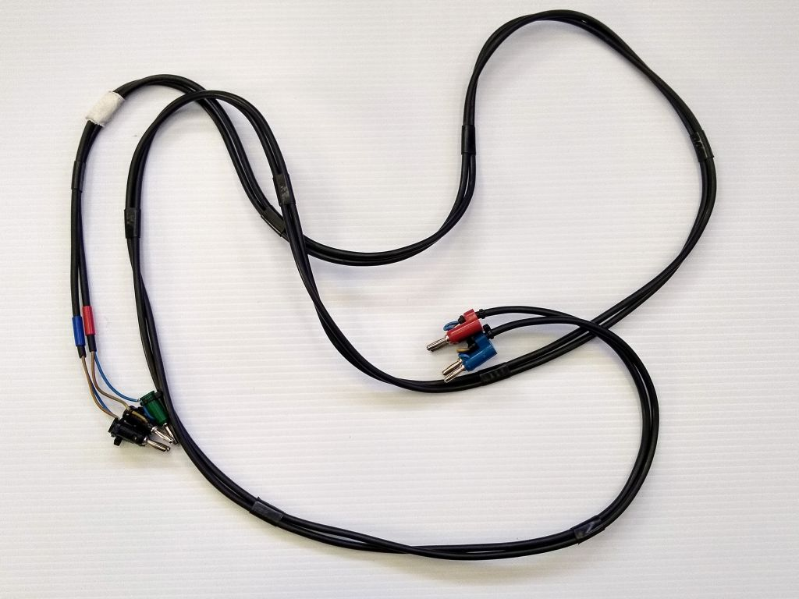
  
:Model number(s): 
  N/A
:Homologation number(s):
  N/A
:Description: 
  Two long adjoined banana-plug-to-TAG-plug adaptors. Used for connecting start block to wire spool.
:Troubleshooting: 
  Check wires, plugs, and connections for signs of damage.
  
Short Start Wand Cable
----------------------

  
:Model number(s): 
  N/A
:Homologation number(s):
  N/A
:Description: 
  Two short adjoined banana-plug-to-TAG-plug adaptors. Used for connecting start block to wire spool.
:Troubleshooting: 
  Check wires, plugs, and connections for signs of damage.  
  
Start Gater
-----------

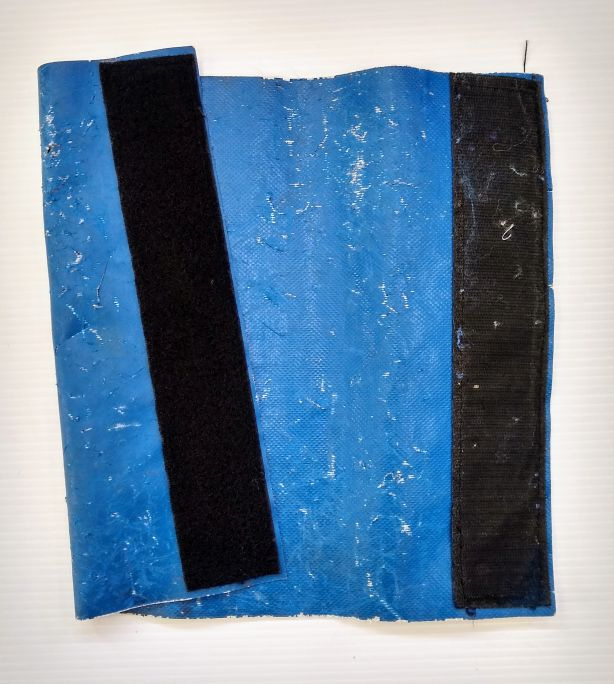
  
:Model number(s): 
  N/A
:Homologation number(s):
  N/A
:Description: 
  Blue plastic with velcro. Used to wrap around start post to protect wiring and connections from ski poles etc.
:Troubleshooting: 
  If velcro won't attach securely, use tape.
  
Electronic Start Clock
----------------------

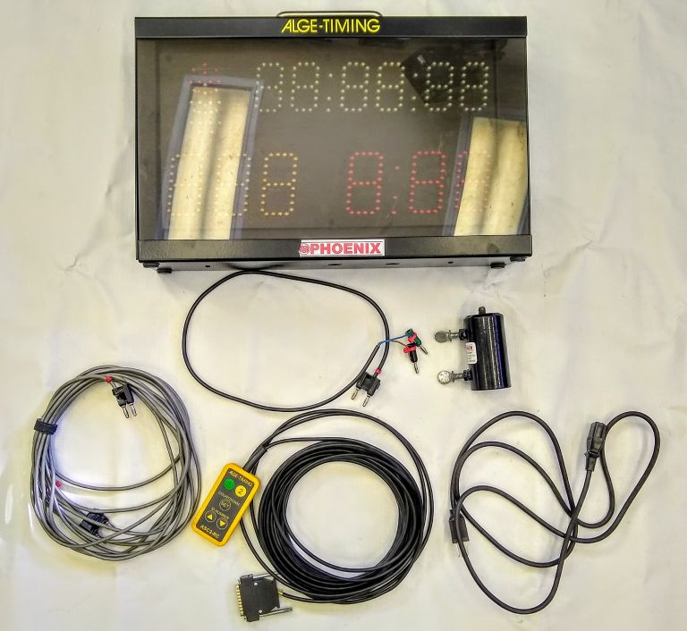
  
:Model number(s): 
  Alge ASC3
:Homologation number(s):
  N/A
:Description: 
  Two long adjoined banana-plug-to-TAG-plug adaptors. Used for connecting start block to wire spool.
:Troubleshooting: 
  **WIRING AND SETUP**
  
  1.	Attach bracket to clock before attaching bracket to post

  2.	Connect the remote to the multiport slot on right side of clock, and screw down finger tight.

  3.	Use timing wire to connect the start gate to the ‘start’ input on right side of clock, paying attention to polarity.
  
  **SYNCING TIME OF DAY**
  
  1.	When ready for sync, turn clock on.

  2.	Top of clock says ‘store’. Hit Green #1 button on remote until bottom of clock says “no”. Hit Yellow #2 button to continue.

  3.	Top of clock says ‘scan’. Hit Yellow #2 button to continue.

  4.	Set time of day according to instructions from timekeeper. Use Green #1 button to increase digit, use Yellow #2 button to advance to next digit. 

  5.	When correct time is displayed wait until ‘sync’ flashes on bottom of clock.

  6.	Open start wand on signal from timekeeper to sync start clock.

  7.	Clock says ‘ProGrA’ at top. Use Green #1 button to make sure bottom of clock says ‘01’. Hit Yellow #2 button to continue.
  
  **SETTING INTERVAL AND BRIGHTNESS**
  
  1.	Time of day is on top of clock, countdown on bottom right, and bib number on bottom left. Hold down arrow on remote until bib number disappears.

  2.	Press Yellow button. Clock says ‘cd’ at top and interval time at bottom. Use Green button to select interval and Yellow to confirm.

  3.	Hold Yellow button until clock reads ‘brgt’ at top. Press Green button until bottom reads ‘3’ and press Yellow to confirm.

  4.	Remove remote and wire to start wand.

  **If you have trouble, power cycle clock and start again.**

Finish Area
~~~~~~~~~~~
  
Impulse Distributor
-------------------

.. image:: ../img/equipment/impluse-distributor.jpg
  :width: 10pt
  
:Model number(s): 
  HL 553
:Homologation number(s):
  N/A
:Description: 
  An impulse distributor with two inputs, each input with two outputs. Used to eliminate false impulses caused by electrical noise at Mammoth Mountain.
:Troubleshooting: 
  Turn it on! Check batteries. Check all connections. Is an input light solid red? This indicates a wiring problem, possibly a short in the hill wire. Sometimes reversing polarity can help
  
Photocell Pair
--------------

  
:Model number(s): 
  HL 2-31, HL2-32, HL 2-33
:Homologation number(s):
  add
:Description: 
  Matched pair of photocells for finish line or intermediate time.
:Troubleshooting: 
  Check batteries. Check to see if photocell lense is clouded over. Make sure pair is matched. HL 2-32 and 2-33 pairs require on receiver photocell and one transmitter photocell. HL 2-31 matched pairs should be close in serial number.
  
Photocell Gimble
----------------

  
:Model number(s): 
  N/A
:Homologation number(s):
  N/A
:Description: 
  Used to attach photocell to finish post.
:Troubleshooting: 
  Is it broken? Don't whack it with the hammer!
  
Scored Finish Post
------------------

  
:Model number(s): 
  N/A
:Homologation number(s):
  N/A
:Description: 
  Wooden post to hold photocells. Scored at the bottom on all four sides to allow for easy breakage upon impact, per FIS rules.
:Troubleshooting: 
  Be easy. Don't smash it with your boot, or a drill, or a hammer.
  
Cheese Wedge Pad
----------------

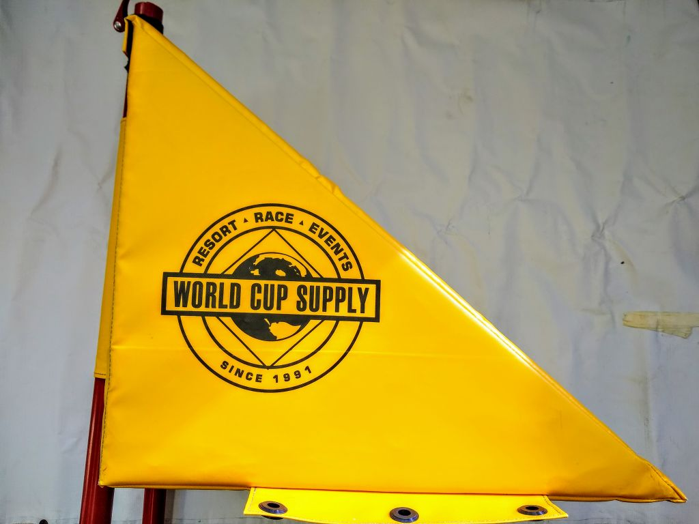
  
:Model number(s): 
  N/A
:Homologation number(s):
  N/A
:Description: 
  Plastic and foam pad, used to protect finish posts and photocells.
:Troubleshooting: 
  Make sure backing posts have clips attached to prevent losing them.
  
Finish Panel
------------

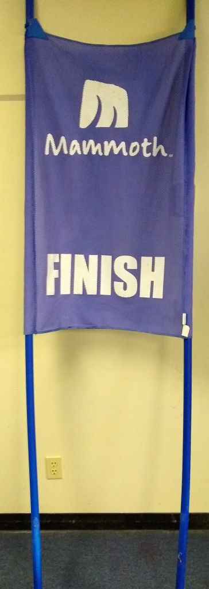
  
:Model number(s): 
  N/A
:Homologation number(s):
  N/A
:Description: 
  Red or blue branded Mammoth panel on static SPM poles. Used to mark finish line.
:Troubleshooting: 
  Replace with correct branding.
  
Homologated Timer
----------------

  
:Model number(s): 
  CP 540, CP 545
:Homologation number(s):
  N/A
:Description: 
  TAG Homogated ToD timing device. 4 input channels. See CP 540 Section.
:Troubleshooting: 
  See CP 540 Section.
  
Wiring and Cables
~~~~~~~~~~~~~~~~~

TAG-to-TAG Cable
----------------

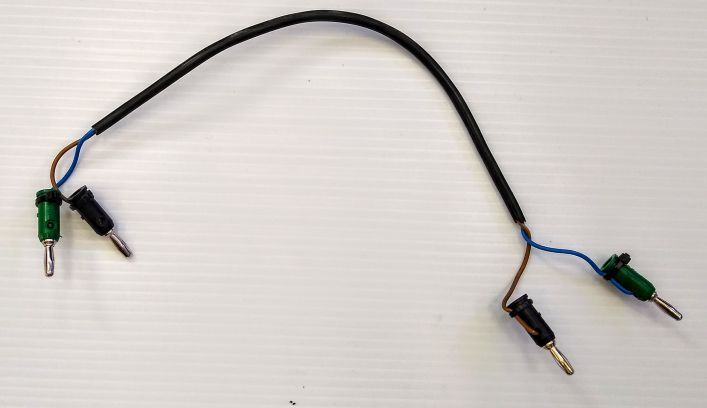
  
:Model number(s): 
  N/A
:Homologation number(s):
  N/A
:Description: 
  Short cable with single TAG style plugs on either end. Used mainly for connecting distributors to timers.
:Troubleshooting: 
  Check for damage.
  
Tag-to-Banana Cable
-------------------

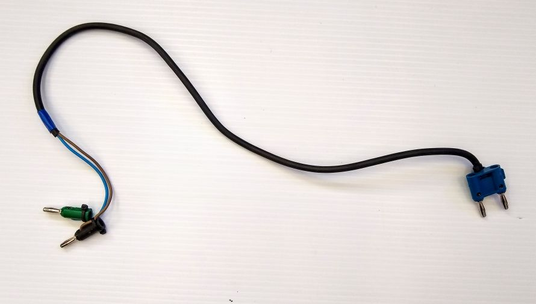
  
:Model number(s): 
  N/A
:Homologation number(s):
  N/A
:Description: 
  Short cable with single TAG style plugs on one end and a double banana plug on the other end. Used for connecting impulse distributors to shack timing boards, or for connecting photocells to wire spools.
:Troubleshooting: 
  Check for damage.
  
Three Pair Spool
----------------

  
:Model number(s): 
  N/A
:Homologation number(s):
  N/A
:Description: 
  Wire spool with three pairs, normally labeled Time 1, Time 2, and COM. Used especially for connecting homologated start boxes and headsets to hill wire.
:Troubleshooting: 
  Check for obvious damage. If there is no obvious damage, use line break detector to determine location of damaged section.
