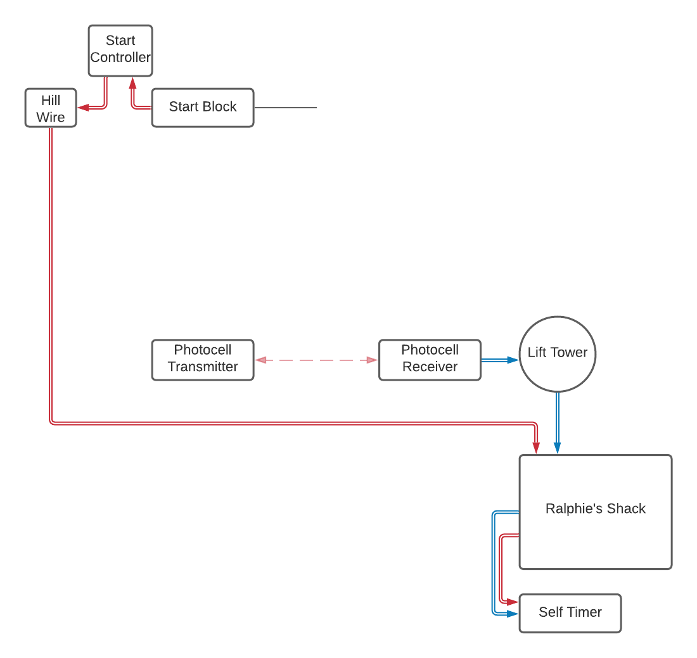

Ralphie's Free Course
=====================

	Signal flow of the free course.

The free course on Ralphie's is a self-timed, non-homologated race course for the public. It is designed to operate without staff at the start or the finish. A start controller box at the start controls the start interval using red and green lights. Timing is handled internally in the :ref:`Alge Self Timer` display board. All that is needed is to connect the start (with controller) and finish to the display board.

The Start
---------

:Equipment Needed:
	.. include:: ../../equipment/kits/free-course-start-kit.rst
	
Mount the start controller on bamboo between the start wand and the hill wire timing box. It is important to use an automatic returning start wand since this start will be unstaffed. Use one of the long pigtails to connect the start block to one of the leads on the self-timer start controller. Trench this wire under the snow to protect it from accidental disconnection. Use the other long pigtail to connect the other start controller lead to the hill wire box. Use the Time 1 plug.

The Finish
----------

:Equipment Needed:
	.. include:: ../../equipment/kits/non-homologated-finish-kit.rst
	
The finish should be setup following the normal procedure for non-homologated races. Only one finish beam is needed. It can be a photocell pair, or a photocell and a reflector. A photocell and reflector works fine on sunny days, but a pair of photocells will be more resistant to problems if there is wind or snow.

Use a :ref:`Hand Spool` to connect the photocell to the timing box on the lift tower, and trench the wire in. There are two pairs in the timing box. Remember which one you connect to.

Dye the finish line red.

Timing Shack
------------

:Equipment Needed:
	- :ref:`Alge Self Timer`
	- A variety of :ref:`pigtails <Pigtail>`
	
Since all of the timing functionality is contained within the self-timer display board, the setup needed inside the timing shack is minimal. You just need to connect the start and finish to the display board itself. This can be accomplished by jumping a few connections on the Ralphie's shack timing board. 

The start should be connected to the 'Time 1' output on the timing board. Use a pigtail to jump this to the self-timer start input. The finish is connected to either one of the two finish outputs on the board. These should be round plugs with jumpers already attached. Remember which one you plugged into on the lift tower and plug the appropriate jumper into the self-timer finish input on the timing board.

Testing and Troubleshooting
---------------------------

There should be at least someone at the start and someone inside the shack to effectively test. It is also helpful to have someone at the finish if possible.

The first step is to get a green light on the start controller. If there is a problem the light will usually stay lit solid red. Check polarity first. Oftentimes swapping the polarity of the banana plug in the hill wire box will solve it. You can also try changing polarity inside the timing shack. If this doesn't work, double check your connections at the start and in the timing shack. Double check the functionality of the hill wire.

Once everthing is setup correctly, the start controller should show a green 'Go' light. When the wand is opened it will turn red for 10 to 15 seconds, then green again. The self-timer supports multiple racers on course.

Check that the timer starts counting up when the wand is opened, and stops on a finish impulse. If there is someone at the finish have them give you an impulse with their hand. If not, you can use a shorting bar to give an impulse in the shack. Just make sure to test the finish after.

If you have persistent trouble, start checking the condition of the display board and the wires connected to it. They have likely been outside year-round and may have been damaged by the sun or possibly by lightning. If you have doubts about the timing wire connecting the self-timer display board to the timing board inside the shack, run a new one. Run a hand spool that you are confident in out the door and make the connection directly.

If you still can't get it to work, bring the display board and the start controller inside the Hilton and test it there. If it works inside the Hilton, look for trouble with the hill wires on Ralphie's. If it doesn't, the self-timer likely needs service. 